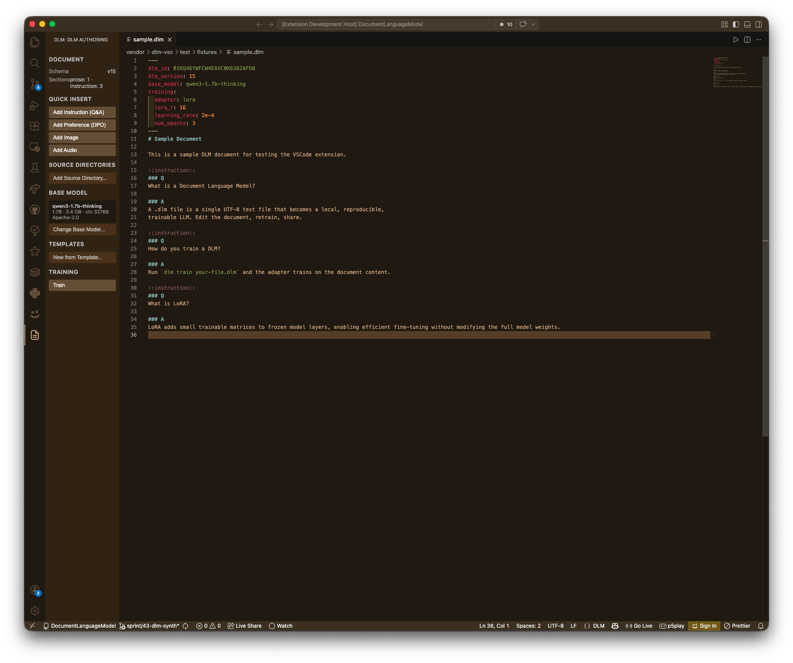
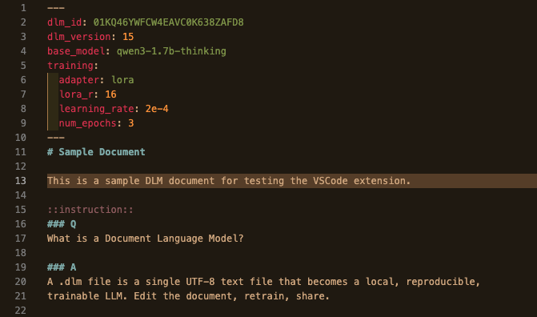
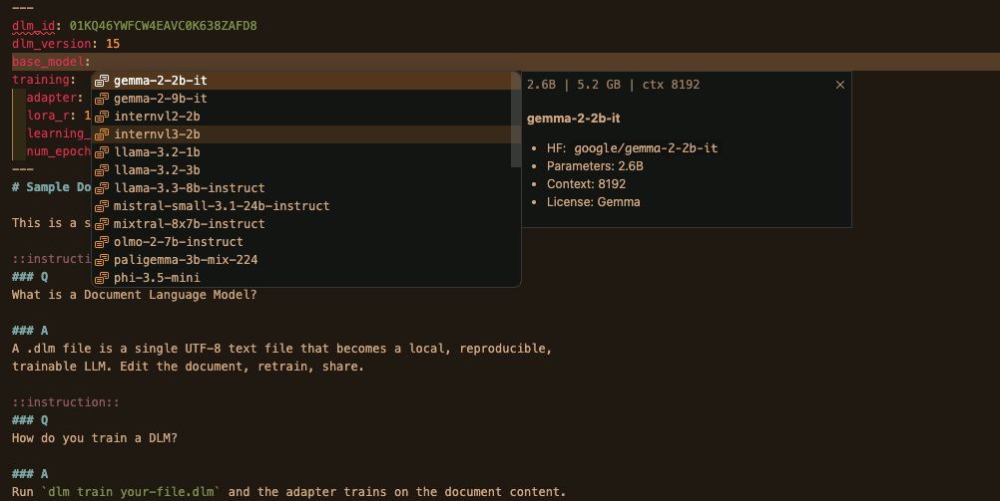
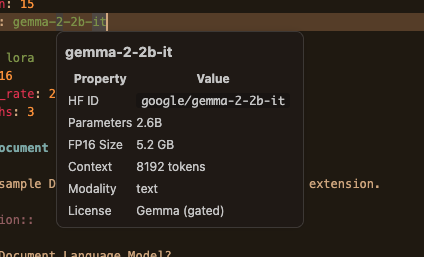
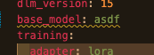
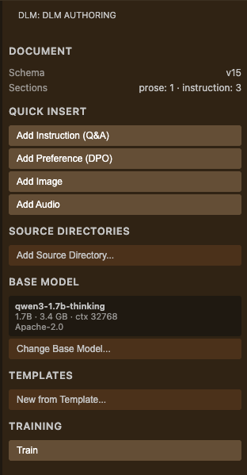

# DLM — Document Language Model

> Turn a text file into a fine-tuned LLM. Edit the document, retrain, share.

A `.dlm` file is YAML frontmatter + markdown body with `::instruction::` and `::preference::` sections. Train a LoRA adapter on your document, prompt it, export to Ollama. This extension makes `.dlm` authoring a first-class editor experience.



## Features

### Syntax-aware editing

YAML frontmatter, markdown body, and section fences (`::instruction::`, `::preference::`, `::image::`, `::audio::`) get distinct, theme-aware highlighting. Q/A headers inside instruction blocks are styled.



### Smart completions

Autocomplete for the 26-entry base-model registry, adapter types, quantization levels, and section fences — all driven by the live schema.



### Hover insight

Hover any base-model key to see params, VRAM footprint, context length, modality, and license. Hover a section fence for the section ID and quick stats.



### Live diagnostics

Schema errors, unknown base models, and Doctor warnings (VRAM headroom, unsafe combinations) surface inline as you type — no save required.



### Side panel — frictionless authoring

A dedicated DLM activity-bar view with everything you need to compose a `.dlm`:

- **Quick Insert** — Instruction, Preference, Image, and Audio buttons drop snippet templates with tab stops at the cursor
- **Source Directory Manager** — native folder picker; relative paths computed and inserted into frontmatter via the LSP
- **Base Model Browser** — searchable QuickPick over the full registry; click to set `base_model`
- **Template Gallery** — 8 bundled templates with one-click bootstrap
- **Document Overview** — section counts, store status, adapter version
- **Training Controls** — Run / Stop in an integrated terminal



### Transparent store creation

Open a `.dlm` file. The content-addressed store at `~/.dlm/store/<dlm_id>/` is created on the spot — no manual `dlm init` needed.

## Requirements

1. **Python 3.11+** with the `document-language-model` package:

   ```bash
   pip install document-language-model
   ```

2. **`dlm-lsp` language server**:

   ```bash
   pip install dlm-lsp
   ```

3. *(Optional)* For training, choose a hardware-appropriate base. The Doctor panel will tell you what fits.

## Quick start

1. Install the extension.
2. Create a new file with a `.dlm` extension. The side panel becomes available immediately.
3. Click **Add Instruction** in the side panel and fill in the Q / A.
4. Open the **Base Model Browser** and pick a small base (e.g. `qwen2.5-0.5b`) for a fast first run.
5. Run `DLM: Train Current Document` from the command palette (⇧⌘P / Ctrl+Shift+P).
6. Run `DLM: Prompt` to chat with your trained adapter.
7. Run `DLM: Export` to package an Ollama-ready `Modelfile + GGUF`.

## Commands

| Command                           | What it does                                   |
| --------------------------------- | ---------------------------------------------- |
| `DLM: Train Current Document`     | Fine-tune the LoRA adapter on the open `.dlm`  |
| `DLM: Export`                     | Export `base.gguf + adapter.gguf + Modelfile`  |
| `DLM: Synth Instructions`         | Generate synthetic Q/A pairs from your sources |
| `DLM: Show Run History`           | Browse training runs for the current document  |
| `DLM: Open Store Directory`       | Reveal `~/.dlm/store/<id>` in the file manager |
| `DLM: Insert Instruction Section` | Drop an instruction block at the cursor        |
| `DLM: Insert Preference Section`  | Drop a preference block at the cursor          |

## Settings

| Setting              | Default       | Description                                                |
| -------------------- | ------------- | ---------------------------------------------------------- |
| `dlm.command`        | `uv run dlm`  | Command to invoke the dlm CLI (use `dlm` for system venv)  |
| `dlm.home`           | `""`          | Override the `~/.dlm` store root                           |
| `dlm.defaultBase`    | `""`          | Default `base_model` for new documents                     |
| `dlm.watchOnSave`    | `false`       | Auto-retrain on save                                       |
| `dlm.lspPath`        | `dlm-lsp`     | Path to the `dlm-lsp` binary                               |

If `dlm` is on your PATH (e.g. installed system-wide), set `dlm.command` to `dlm`. The default `uv run dlm` works inside a `uv`-managed project.

## Multi-editor support

The language server is editor-agnostic. Cookbook entries for Zed, Helix, and Neovim live in the [main repository](https://github.com/tenseleyFlow/DocumentLanguageModel/tree/trunk/docs/cookbook).

## Links

- [DLM main repository](https://github.com/tenseleyFlow/DocumentLanguageModel)
- [dlm-lsp language server](https://github.com/tenseleyFlow/dlm-lsp)
- [Issues](https://github.com/tenseleyFlow/dlm-vsc/issues)

## License

MIT
